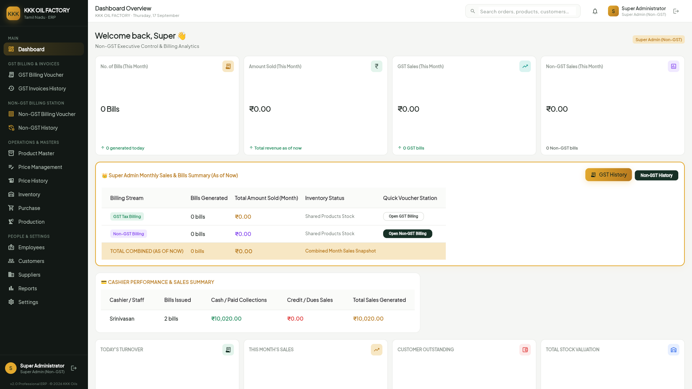
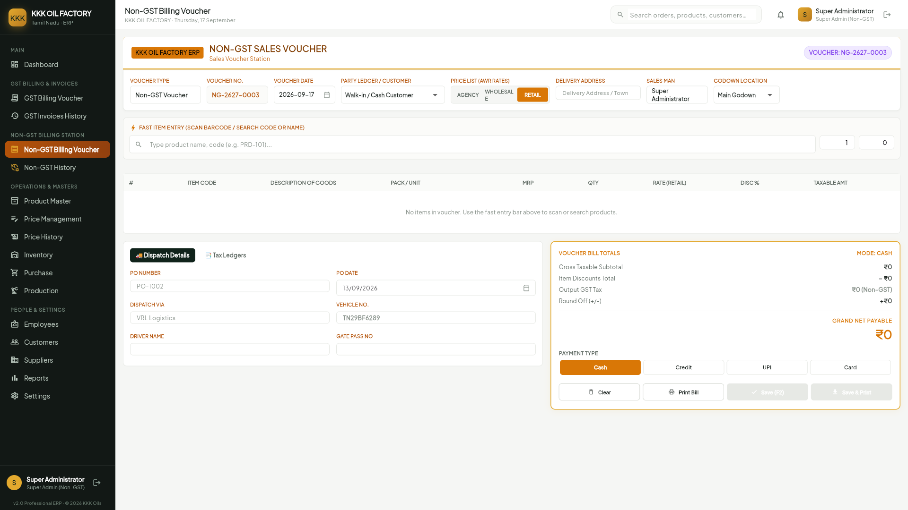
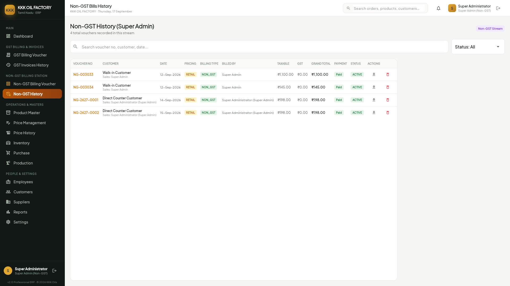
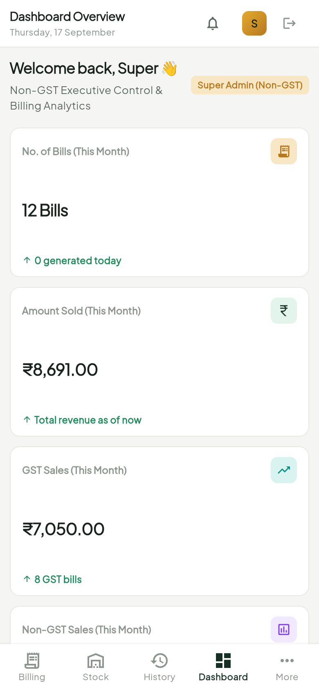
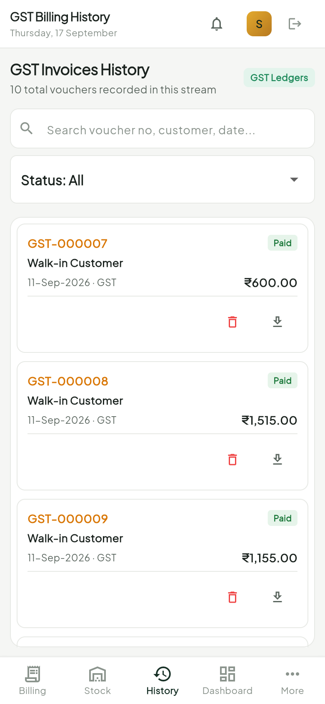

# கே.கே.கே ஆயில் மில் - உள்நாட்டு மண்டி கொள்முதல் & நேரடி விற்பனை கையேடு
## KKK Oil Factory ERP · Dedicated Non-GST Station Manual (v2.5.0)

> **முக்கிய குறிப்பு (Important Note):** இந்த கையேடு ஆலை வாசல் மண்டி விதை கொள்முதல் மற்றும் பாத்திரங்களில் சில்லறையாக எண்ணெய் வாங்குபவர்களுக்கான நேரடி பண பரிவர்த்தனை கவுண்டருக்கு மட்டுமே உரியது. அனைத்து விளக்கங்களும் எளிய தமிழில் தரப்பட்டுள்ளன.

---

## பொருளடக்கம் & பக்க வழிகாட்டி (Table of Contents)

### கணினி டெஸ்க்டாப் திரைகள் (Desktop Screens NG-01 to NG-03)
1. [பக்கம் 3] `NG-01 · /nongst-dashboard` — உள்நாட்டு மண்டி கட்டுப்பாட்டு பலகை
2. [பக்கம் 4] `NG-02 · /nongst-billing` — மண்டி எடை மேடை & நேரடி எண்ணெய் கவுண்டர்
3. [பக்கம் 5] `NG-03 · /nongst-history` — உள்நாட்டு ரசீதுகள் பதிவேடு & தணிக்கை

### மொபைல் செயலி திரைகள் (Mobile Screens NGM-01 to NGM-03)
4. [பக்கம் 6] `NGM-01` — Mobile Non-GST Dashboard (மொபைல் மண்டி பலகை)
5. [பக்கம் 7] `NGM-02` — Mobile Non-GST Fast Billing (மொபைல் நேரடி சில்லறை விற்பனை)
6. [பக்கம் 8] `NGM-03` — Mobile Non-GST History (மொபைல் டோக்கன் வரலாறு & ரசீது)

### முதன்மை குறிப்பு & மண்டி SOP விதிமுறைகள்
7. [பக்கம் 9] Non-GST Master Buttons Reference (மண்டி முக்கிய பொத்தான்கள் அட்டவணை)
8. [பக்கம் 10] Mandi Procurement & Loose Oil SOP (விவசாயிகள் விதை வரவு & நேரடி விநியோகம் SOP)

---

## NG-01 · Mandi Overview (`/nongst-dashboard`)

- **நோக்கம்**: மண்டி விதை வரவு, கவுண்டர் நேரடி எண்ணெய் விற்பனை மற்றும் கல்லாப்பெட்டி ரொக்கத்தை கண்காணிக்கும் பலகை.
- **முக்கிய பொத்தான்கள்**:
  - `New Voucher (F1)` : புதிய மண்டி கொள்முதல் அல்லது விற்பனை சீட்டு போடும் பக்கத்திற்கு செல்ல.
  - `Direct Loose Billing` : பாத்திர சில்லறை விற்பனை கவுண்டருக்கு உடனே செல்ல.
  - `Refresh Mandi Totals` : இன்றைய விதை வரவு மற்றும் ரொக்க அளவை புதுப்பிக்க.
  - `Day End Cash Close` : மாலையில் கல்லாப்பெட்டி ரொக்கத்தை கணக்கிட்டு முடிக்க.

---

## NG-02 · Counter Weighbridge & Loose POS (`/nongst-billing`)

- **நோக்கம்**: விவசாயிகள் கொண்டுவரும் விதை மூட்டைகளை எடை போட்டு பணம் பட்டுவாடா செய்யவும், பாத்திர சில்லறை எண்ணெய் டோக்கன் போடவும் பயன்படும் திரை.
- **முக்கிய பொத்தான்கள்**:
  - `Save Voucher (F2)` : வவுச்சரை சேமித்து, எடையை உறுதி செய்து, சீட்டு தயார் செய்ய.
  - `Read Counter Scale (F4)` : தராசிலிருந்து எடையை தானாக திரையில் கொண்டுவர.
  - `Print Thermal Token` : சிறிய 3-இன்ச் தெர்மல் பிரிண்டரில் உடனடி ரசீது டோக்கன் வழங்க.
  - `Cash Outflow Pay` : விவசாயிக்கு விதைக்கான ரொக்கம் வழங்கியதை பதிவு செய்ய.

---

## NG-03 · Mandi Cash Register & Reprints (`/nongst-history`)

- **நோக்கம்**: போடப்பட்ட அனைத்து மண்டி சீட்டுகளையும் பட்டியலாக பார்த்து, தேவைப்பட்டால் மீண்டும் அச்சிடும் திரை.
- **முக்கிய பொத்தான்கள்**:
  - `Reprint Token (F3)` : பழைய டோக்கன் சீட்டை மீண்டும் தெர்மல் பிரிண்டரில் அச்சிட.
  - `Cancel Ticket` : தவறான மண்டி சீட்டை ரத்து செய்ய (மேற்பார்வையாளர் அனுமதி தேவை).
  - `Export Cash Register` : இன்றைய மண்டி வரவு செலவுகளை எக்செல் கோப்பாக பதிவிறக்க.

---

## NGM-01 · Mobile Mandi Dashboard

- **நோக்கம்**: மொபைலில் நேரடி ரொக்க கையிருப்பு மற்றும் விதை வரவை கண்காணிக்க உதவும் திரை.
- **முக்கிய பொத்தான்கள்**: `Fast Loose Billing`, `Weighbridge Check`, `Refresh Till Balance`.

---

## NGM-02 · Mobile Direct Loose Billing POS

- **நோக்கம்**: செக்கு வாசலில் பாத்திரத்தில் எண்ணெய் வாங்குபவர்களுக்கு மொபைலில் உடனடி டோக்கன் போடும் கவுண்டர்.
- **முக்கிய பொத்தான்கள்**: `Issue Loose Token`, `Print Bluetooth Slip`, `Cash Received`.

---

## NGM-03 · Mobile Voucher Register & Reprints

- **நோக்கம்**: அன்றைய அனைத்து ரொக்க டோக்கன்களையும் மொபைலில் சரிபார்க்க உதவும் திரை.
- **முக்கிய பொத்தான்கள்**: `Reprint Bluetooth Slip`, `Daily Cash Total`.

---

## Non-GST Master Buttons & Hotkeys Reference
| சுருக்குவழி | பொத்தான் பெயர் | பயன்படும் திரை | செயல்முறை விளக்கம் |
| :--- | :--- | :--- | :--- |
| **F1** | `New Voucher` | `/nongst-dashboard` | புதிய மண்டி விதை வரவு அல்லது சில்லறை சீட்டு போடும் பக்கத்திற்கு செல்லும். |
| **F2** | `Save Voucher` | `/nongst-billing` | வவுச்சரை சேமித்து, எடையை உறுதி செய்து, டோக்கன் அச்சிடும். |
| **F4** | `Read Counter Scale` | `/nongst-billing` | தராசில் உள்ள எடையை தானாக திரையில் கொண்டுவரும். |
| **F3** | `Reprint Token` | `/nongst-history` | முந்தைய மண்டி டோக்கன் அல்லது எடை ரசீதை மறுபதிப்பு எடுக்கும். |

---

## Mandi SOP: விதை கொள்முதல் & சில்லறை விநியோகம் செயல்முறை
1. **விவசாயி விதை வரவு**: விவசாயி மூட்டைகளுடன் வந்தவுடன் தராசில் வைத்து `F4 (Read Counter Scale)` மூலம் எடையை பதிவு செய்யவும்.
2. **ஈரப்பதம் கழித்து வவுச்சர் போடுதல்**: கழிவு சதவீதம் கணக்கிட்டு `Save Voucher (F2)` கொடுத்து சீட்டு போடவும்.
3. **ரொக்க பட்டுவாடா**: கல்லாவிலிருந்து விவசாயிக்கு ரொக்கம் வழங்கி `Cash Outflow Pay` பொத்தானை அழுத்தவும்.
4. **பாத்திர சில்லறை விநியோகம்**: கேன் கொண்டுவரும் வாடிக்கையாளர்களுக்கு `Issue Loose Token` மூலம் புளூடூத் டோக்கன் வழங்கவும்.
5. **மாலை கணக்கு சமர்ப்பிப்பு**: ஆலை மூடும் போது `Day End Cash Close` கொடுத்து ரொக்கத்தை மேலாளரிடம் ஒப்படைக்கவும்.
