# கே.கே.கே ஆயில் மில் - விற்பனை & பொது பயன்பாட்டு கையேடு
## KKK Oil Factory Enterprise ERP · Standard Operations Manual (v2.5.0)

> **முக்கிய குறிப்பு (Important Note):** இந்த கையேடு ஆலை பணியாளர்கள், பில்லிங் காசாளர்கள் மற்றும் மேற்பார்வையாளர்களுக்கான நேரடி செயல்பாட்டு வழிகாட்டியாகும். விளக்கங்கள் அனைத்தும் எளிய தமிழில் வழங்கப்பட்டுள்ளன; மென்பொருளில் உள்ள பொத்தான்கள் (Buttons) மற்றும் விசைப்பலகை குறுக்குவழிகள் (Hotkeys) எளிதாக அடையாளம் காணும் வகையில் ஆங்கிலத்தில் கொடுக்கப்பட்டுள்ளன.

---

## பொருளடக்கம் & பக்க வழிகாட்டி (Table of Contents)

### பகுதி 1: கணினி டெஸ்க்டாப் திரைகள் (Desktop Screens 01 to 15)
1. [பக்கம் 3] `01 · /login` — உள்நுழைவு & பாதுகாப்பு வாயில் (User Authentication Gate)
2. [பக்கம் 4] `02 · /dashboard` — முதன்மை கட்டுப்பாட்டு பலகை (Executive Overview)
3. [பக்கம் 5] `03 · /billing` — மொத்த & சில்லறை விற்பனை பில்லிங் (B2B GST POS)
4. [பக்கம் 6] `04 · /billing-history` — பில் வரலாறு & மறுபதிப்பு (Invoices & Cancel)
5. [பக்கம் 7] `05 · /products` — எண்ணெய் ரகங்கள் பட்டியல் (Product Catalog Master)
6. [பக்கம் 8] `06 · /price-management` — தினசரி விலை நிர்ணயம் (Daily Price Engine)
7. [பக்கம் 9] `07 · /price-history` — விலை மாற்ற வரலாறு (Price Audit & Trends)
8. [பக்கம் 10] `08 · /inventory` — சைலோ தொட்டிகள் & இருப்பு (Silo Tanks & Warehouse)
9. [பக்கம் 11] `09 · /purchase` — விதை வரவு & எடை மேடை (Seed Inward & Weighbridge)
10. [பக்கம் 12] `10 · /production` — ஆலை உற்பத்தி & புண்ணாக்கு (Expeller Milling Batches)
11. [பக்கம் 13] `11 · /customers` — வாடிக்கையாளர்கள் கணக்கு (Customer Ledgers & Credit)
12. [பக்கம் 14] `12 · /suppliers` — விதை சப்ளையர்கள் கணக்கு (Vendor & Mandi Directory)
13. [பக்கம் 15] `13 · /reports` — விற்பனை & ஜிஎஸ்டி அறிக்கைகள் (Tax Analytics & GSTR-1)
14. [பக்கம் 16] `14 · /employees` — ஊழியர்கள் & அனுமதி அமைப்புகள் (Staff & Access Roles)
15. [பக்கம் 17] `15 · /settings` — கணினி & பிரிண்டர் அமைப்புகள் (Hardware & System Setup)

### பகுதி 2: மொபைல் செயலி திரைகள் (Mobile Screens M-01 to M-06)
16. [பக்கம் 18] `M-01` — Mobile Login Gateway (மொபைல் உள்நுழைவு திரை)
17. [பக்கம் 19] `M-02` — Mobile Operations Dashboard (மொபைல் கட்டுப்பாட்டு பலகை)
18. [பக்கம் 20] `M-03` — Mobile Fast Billing POS (மொபைல் விரைவு பில்லிங் கவுண்டர்)
19. [பக்கம் 21] `M-04` — Mobile Silo Tanks & Stock Gauges (மொபைல் ஆயில் தொட்டி இருப்பு)
20. [பக்கம் 22] `M-05` — Mobile Voucher History & Reprints (மொபைல் பில் வரலாறு & ரசீது)
21. [பக்கம் 23] `M-06` — Mobile More Modules Navigation Hub (மொபைல் கூடுதல் மெனு அமைப்புகள்)

### பகுதி 3: முதன்மை குறிப்பு & SOP விதிமுறைகள்
22. [பக்கம் 24] Master Button Reference Index (முக்கிய பொத்தான்கள் & சுருக்குவழிகள் பட்டியல்)
23. [பக்கம் 25] Standard Operating Procedures (காலை முதல் இரவு வரை தினசரி SOP)

---

## 01 · Authentication & Session Gate (`/login`)

- **நோக்கம்**: ஆலை ஊழியர்கள் மற்றும் நிர்வாகிகள் தங்களின் கணக்கில் பாதுகாப்பாக உள்நுழைய பயன்படும் முகப்பு திரை.
- **படிவ விவரங்கள்**: `Username` (பயனர் பெயர்: admin, mgr, cashier), `Password` (ரகசிய கடவுச்சொல்).
- **முக்கிய பொத்தான்கள்**:
  - `Sign in` : உள்நுழைந்து உங்கள் பணிக்குரிய முகப்பு திரைக்குச் செல்ல.
  - `Super Admin` : முழு நிர்வாகி கணக்கை தானாக நிரப்ப.
  - `Admin` : ஆலை அலுவலக நிர்வாகி கணக்கை நிரப்ப.
  - `Manager` : ஆலை பொது மேலாளர் கணக்கை நிரப்ப.
  - `Cashier` : விற்பனை பில்லிங் காசாளர் கணக்கை நிரப்ப.
  - `Supervisor` : உற்பத்தி மேற்பார்வையாளர் கணக்கை நிரப்ப.
- **வேலை செய்யும் முறை (Workflow)**:
  1. பயனர் பெயர் மற்றும் கடவுச்சொல்லை தட்டச்சு செய்யவும்.
  2. அல்லது உங்கள் பொறுப்புக்குரிய விரைவு பட்டனை (Admin / Cashier / Manager) அழுத்தவும்.
  3. `Sign in` பொத்தானை அழுத்தினால் உங்கள் முகப்பு திரை திறக்கும்.

---

## 02 · Executive Overview (`/dashboard`)
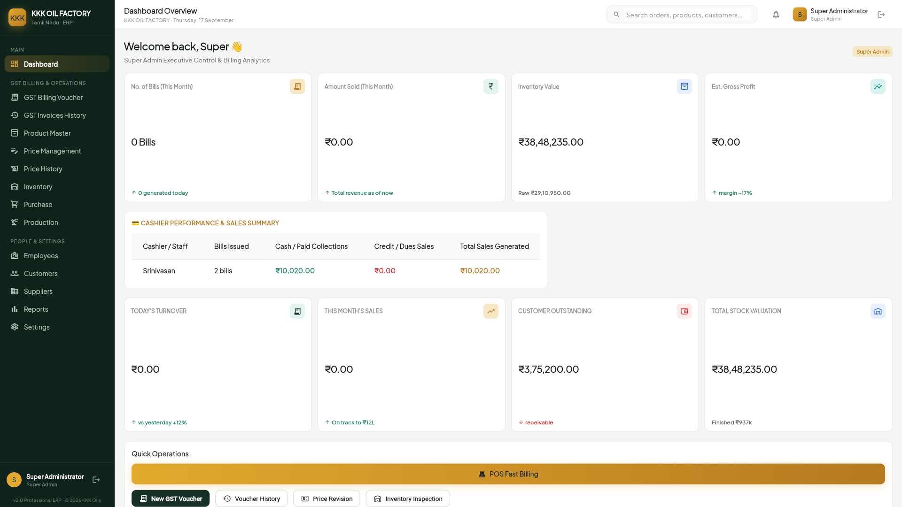
- **நோக்கம்**: ஆலையின் தினசரி மொத்த விற்பனை, கையிருப்பு, உற்பத்தி அளவு மற்றும் நிலுவைத் தொகையை ஒரே பார்வையில் காட்டும் திரை.
- **முக்கிய புள்ளிவிவரங்கள்**: Today Sales ₹ (விற்பனை ரொக்கம்), Silo Tank Stock % (தொட்டி இருப்பு சதவீதம்), Milling Output (உற்பத்தி அளவு).
- **முக்கிய பொத்தான்கள்**:
  - `New Invoice (+)` : புதிய விற்பனை பில் போடும் திரைக்கு உடனடியாக செல்ல.
  - `Record Milling` : புதிய எண்ணெய் ஆலை பேட்ச் பதிவை தொடங்க.
  - `Refresh Data` : சமீபத்திய புள்ளிவிவரங்களை உடனடியாக புதுப்பிக்க.
  - `Export Summary` : இன்றைய விற்பனை சுருக்கத்தை எக்செல் கோப்பாக பதிவிறக்க.
- **வேலை செய்யும் முறை (Workflow)**:
  1. காலையில் பணி தொடங்கும் போது தொட்டிகளின் எண்ணெய் இருப்பு அளவை சரிபார்க்கவும்.
  2. அவசர விற்பனை பில் போட மேல் வலதுபுறத்தில் உள்ள `New Invoice (+)` பொத்தானை அழுத்தவும்.

---

## 03 · B2B GST Invoicing POS (`/billing`)
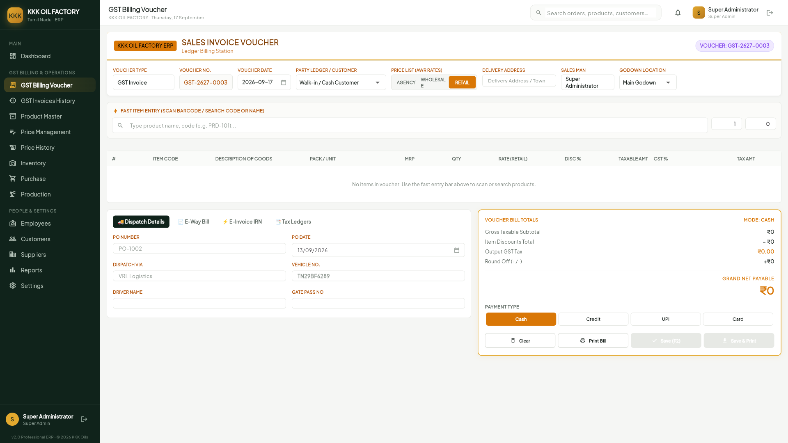
- **நோக்கம்**: எண்ணெய் விநியோகஸ்தர்கள், மொத்த வியாபாரிகள் மற்றும் சில்லறை வாடிக்கையாளர்களுக்கு வரி பில் போட பயன்படும் முதன்மை திரை.
- **படிவ விவரங்கள்**: `Customer Phone / GSTIN` (வாடிக்கையாளர் எண்/ஜிஎஸ்டி), `Product Selector` (எண்ணெய் வகை), `Quantity` (அளவு).
- **முக்கிய பொத்தான்கள்**:
  - `Save Invoice (F2)` : பில்லைச் சேமித்து, சரக்கு இருப்பு கழித்து, பில் உருவாக்க.
  - `Print A4 Tax Invoice` : அரசு அங்கீகாரம் பெற்ற A4 ஜிஎஸ்டி வரி பில் அச்சிட.
  - `Thermal Receipt (3-inch)` : கவுண்டர் வாடிக்கையாளருக்கு சிறிய தெர்மல் ரசீது வழங்க.
  - `Clear Form` : படிவத்தில் உள்ள விவரங்களை நீக்கி புதிதாக்க.
- **வேலை செய்யும் முறை (Workflow)**:
  1. வாடிக்கையாளர் மொபைல் எண் உள்ளிடவும்; பழைய வியாபாரி எனில் பெயர் மற்றும் ஜிஎஸ்டி எண் தானாக வரும்.
  2. எண்ணெய் வகை மற்றும் அளவை உள்ளிடவும்; 5% ஜிஎஸ்டி வரி தானாக கணக்கிடப்படும்.
  3. பணம் செலுத்தும் முறையைத் தேர்வு செய்து `F2` அல்லது `Save Invoice` அழுத்தவும்.

---

## 04 · Billing Records & Reprints (`/billing-history`)
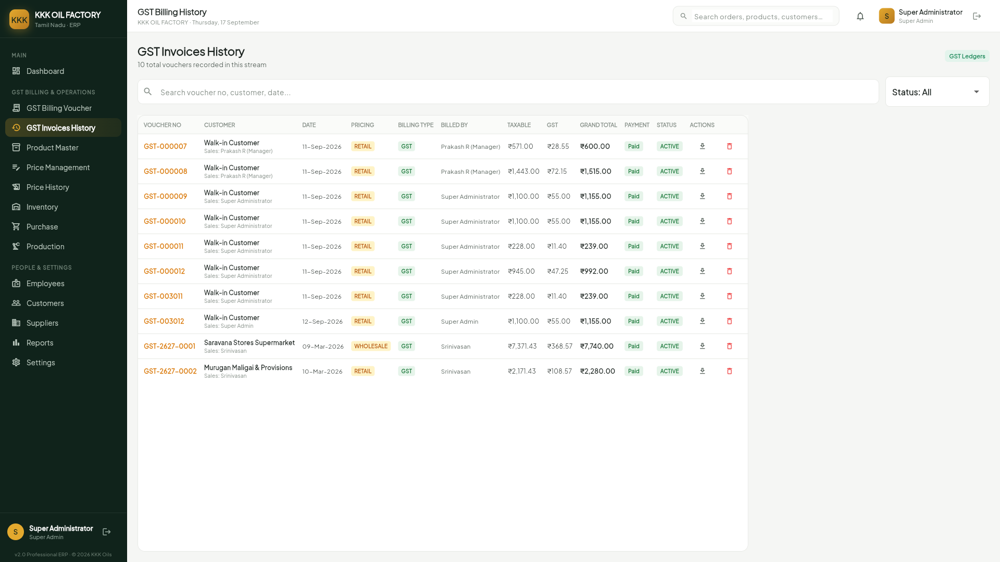
- **நோக்கம்**: கடந்த நாட்களில் போடப்பட்ட அனைத்து ஜிஎஸ்டி பில்களையும் தேடிப் பார்க்க, திருத்த அல்லது மறுபதிப்பு எடுக்க பயன்படும் திரை.
- **முக்கிய பொத்தான்கள்**:
  - `Reprint (A4)` : பழைய பில்லை மீண்டும் தெளிவான A4 தாளில் அச்சிட.
  - `Download PDF` : பில் நகலை வாடிக்கையாளர் வாட்ஸ்அப்பில் அனுப்ப PDF ஆக சேமிக்க.
  - `Cancel Invoice` : தவறான பில்லை ரத்து செய்ய (மேலாளர் அனுமதி தேவை).
  - `Export CSV` : அனைத்து பில் விவரங்களையும் எக்செல் கோப்பாக எடுக்க.

---

## 05 · Master Product Catalog (`/products`)
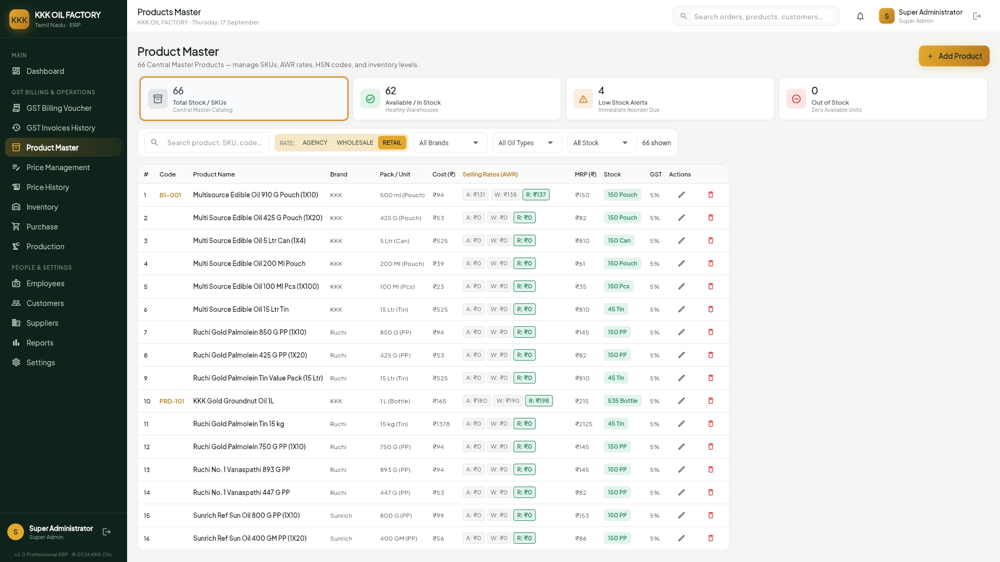
- **நோக்கம்**: ஆலை எண்ணெய் ரகங்கள் (கடலை எண்ணெய், நல்லெண்ணெய், தேங்காய் எண்ணெய்), பேக்கிங் அளவுகள் மற்றும் HSN குறியீடுகளை நிர்வகிக்கும் திரை.
- **முக்கிய பொத்தான்கள்**:
  - `+ Add Product` : புதிய எண்ணெய் அல்லது பேக்கிங் அளவை பட்டியலில் சேர்க்க.
  - `Edit (Pencil)` : பொருளின் பெயர், பேக்கிங் அளவு அல்லது எடையை திருத்த.
  - `Toggle Active` : விற்பனையை தற்காலிகமாக நிறுத்த அல்லது மீண்டும் தொடங்க.

---

## 06 · Daily Price Management (`/price-management`)
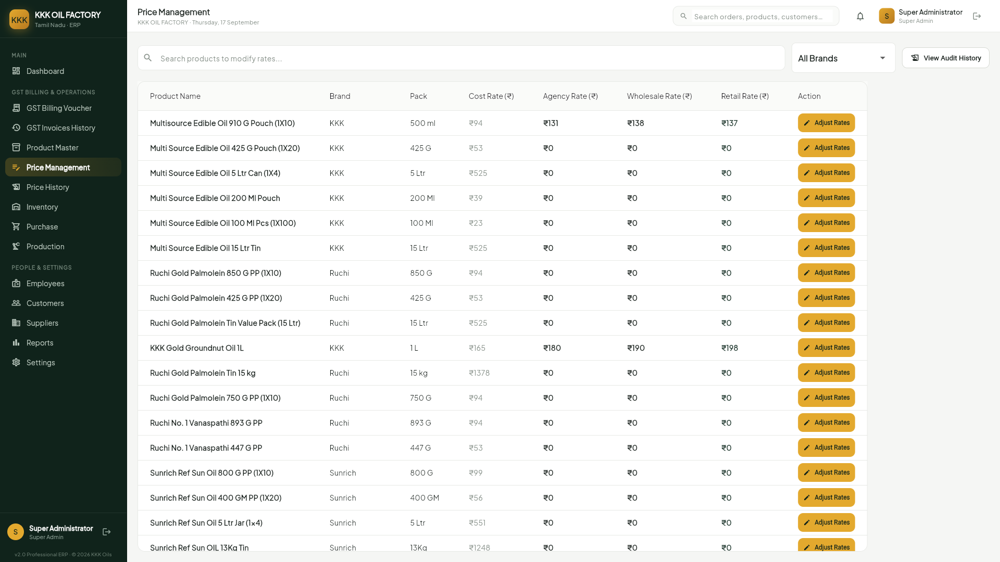
- **நோக்கம்**: சந்தை நிலவரத்திற்கு ஏற்ப எண்ணெய் மற்றும் பிண்ணாக்கு விலைகளை உடனுக்குடன் மாற்றியமைக்க உதவும் நிர்வாக திரை.
- **முக்கிய பொத்தான்கள்**:
  - `Update All Prices` : அனைத்து பொருட்களுக்கும் புதிய விலையை உடனடியாக நடைமுறைப்படுத்த.
  - `Reset to Defaults` : தவறு நடந்தால் முந்தைய விலைக்கு உடனடியாக மாற்ற.
  - `Bulk Margin %` : சதவீத அடிப்படையில் ஒரே கிளிக்கில் விலையை கூட்ட/குறைக்க.

---

## 07 · Price Audit & Trends (`/price-history`)
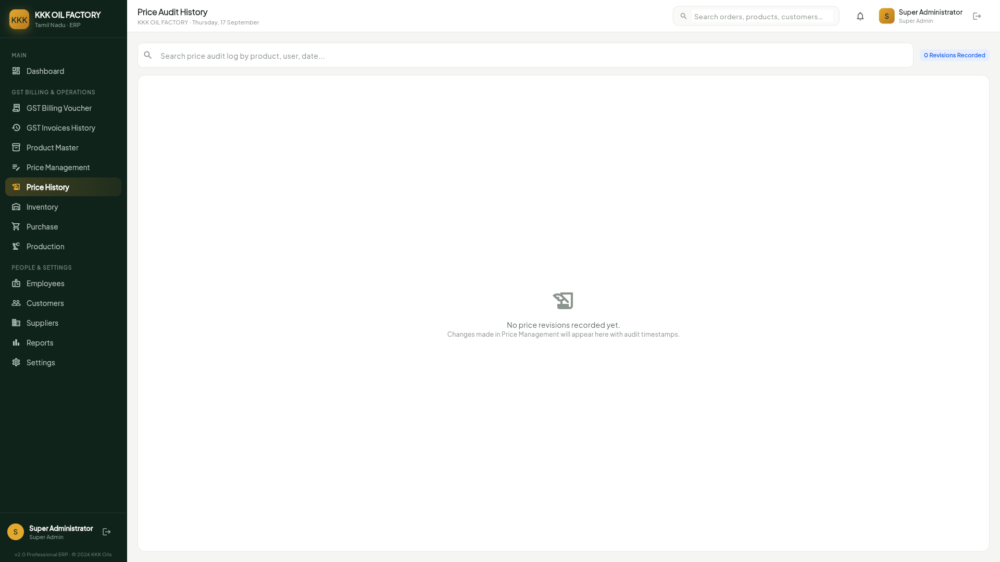
- **நோக்கம்**: கடந்த மாதங்களில் எண்ணெய் விலை எப்பொழுது, யாரால், எவ்வளவு மாற்றப்பட்டது என்பதை தணிக்கை செய்யும் திரை.
- **முக்கிய பொத்தான்கள்**:
  - `Filter by Product` : குறிப்பிட்ட எண்ணெய் ரகத்தின் வரலாற்றை மட்டும் பார்க்க.
  - `Export Audit PDF` : விலை தணிக்கை அறிக்கையை அச்சு வடிவில் பெற.

---

## 08 · Silo Tanks & Stock (`/inventory`)
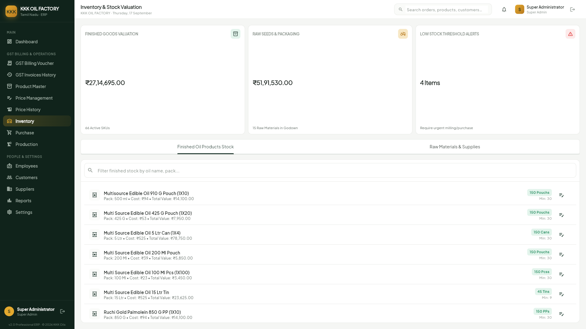
- **நோக்கம்**: பெரிய சேமிப்பு தொட்டிகளில் (Silo Tanks) உள்ள எண்ணெய் மற்றும் குடோனில் உள்ள டின்/கேன் இருப்பை கண்காணிக்கும் திரை.
- **முக்கிய பொத்தான்கள்**:
  - `Stock Adjustment` : நேரடி ஆய்வின்படி கணினி இருப்பை சரிசெய்து திருத்த.
  - `Transfer to Packing` : தொட்டியிலிருந்து பேக்கிங் பகுதிக்கு எண்ணெய் மாற்றத்தை பதிவு செய்ய.
  - `Stock Audit Report` : இன்றைய முழு இருப்பு நிலவரத்தை அச்சிட.

---

## 09 · Seed Inward & Weighbridge (`/purchase`)
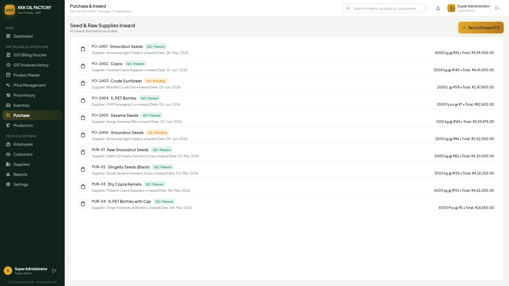
- **நோக்கம்**: விவசாயிகளிடமிருந்தும் சப்ளையர்களிடமிருந்தும் வரும் விதை மூட்டைகள் மற்றும் லாரி எடைமேடை வரவுகளை பதிவு செய்யும் திரை.
- **முக்கிய பொத்தான்கள்**:
  - `Read Weighbridge (F4)` : கணினியுடன் இணைக்கப்பட்ட எடைமேடையிலிருந்து எடையை தானாக பெற.
  - `Save Purchase Inward` : விதை வரவை உறுதி செய்து கிடங்கு கணக்கில் வரவு வைக்க.
  - `Print Inward Slip` : லாரி ஓட்டுநருக்கு அதிகாரப்பூர்வ எடை ரசீது அச்சிட.

---

## 10 · Expeller Milling Batches (`/production`)
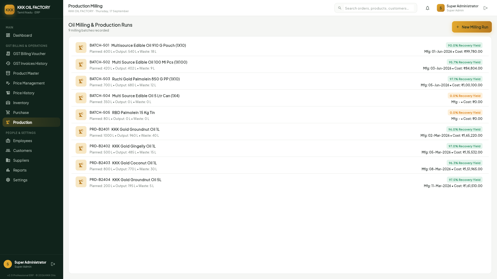
- **நோக்கம்**: செக்கு மற்றும் எக்ஸ்பெல்லர் இயந்திரங்களில் விதைகளை ஆட்டி எண்ணெய் மற்றும் புண்ணாக்கு உற்பத்தி செய்வதை பதிவு செய்யும் திரை.
- **முக்கிய பொத்தான்கள்**:
  - `Start Milling Batch` : இயந்திரத்தில் புதிய அரவை பேட்சை முறைப்படி தொடங்க.
  - `Complete Milling Batch` : அரவை முடிந்ததும் எண்ணெய் மற்றும் புண்ணாக்கு அளவை சேமிக்க.
  - `Quality Pass` : ஆய்வக தரக்கட்டுப்பாடு சான்றிதழ் அளித்து தொட்டிக்கு மாற்ற.

---

## 11 · Customer Ledgers & Credit (`/customers`)
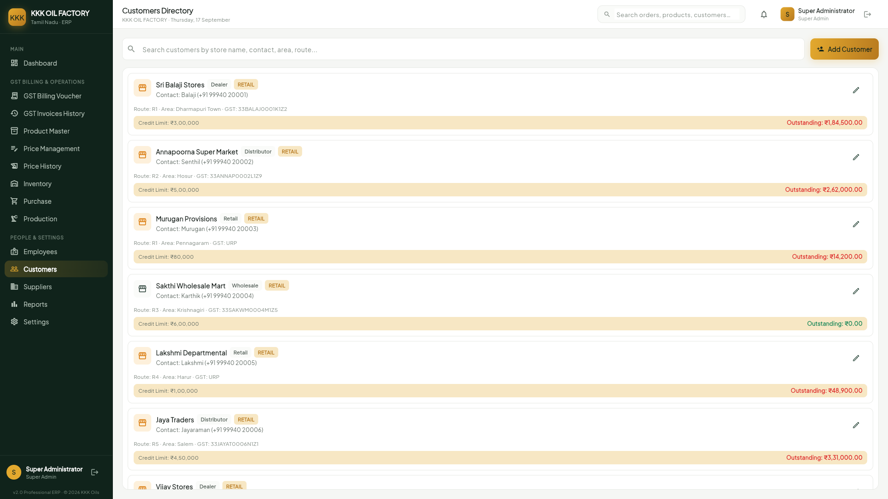
- **நோக்கம்**: மொத்த மற்றும் சில்லறை வியாபாரிகளின் முகவரி, தொலைபேசி எண், ஜிஎஸ்டி எண் மற்றும் கடன் நிலுவைத் தொகையை நிர்வகிக்கும் திரை.
- **முக்கிய பொத்தான்கள்**:
  - `+ Add Customer` : புதிய வியாபாரி அல்லது வாடிக்கையாளரை கணக்கில் பதிவு செய்ய.
  - `Receive Payment` : பழைய பாக்கி வசூலானால் ரொக்கம்/வங்கி வழியே வரவு வைக்க.
  - `View Full Ledger` : முழுமையான வரவு செலவு கணக்கை பார்க்க.
  - `Print Statement` : வாடிக்கையாளருக்கு அனுப்ப கணக்கு பேரேடு நகல் அச்சிட.

---

## 12 · Seed Suppliers & Mandis (`/suppliers`)
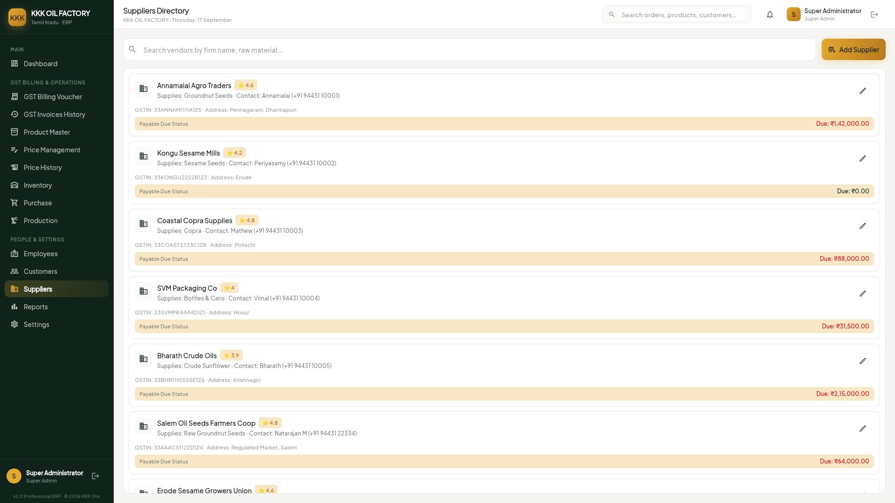
- **நோக்கம்**: ஆலைக்கு விதை வழங்கும் சப்ளையர்கள் மற்றும் விவசாய சங்கங்களின் கொள்முதல் கணக்குகளை பராமரிக்கும் திரை.
- **முக்கிய பொத்தான்கள்**:
  - `+ Add Supplier` : புதிய மண்டி சப்ளையர் அல்லது வியாபாரியை பதிவு செய்ய.
  - `Record Supplier Payment` : வங்கி மூலம் பணம் செலுத்தியதை பதிவு செய்ய.
  - `View Purchase History` : சப்ளையரிடமிருந்து வாங்கிய அனைத்து லாரி எடை பட்டியலை பார்க்க.

---

## 13 · Tax Analytics & GSTR-1 (`/reports`)
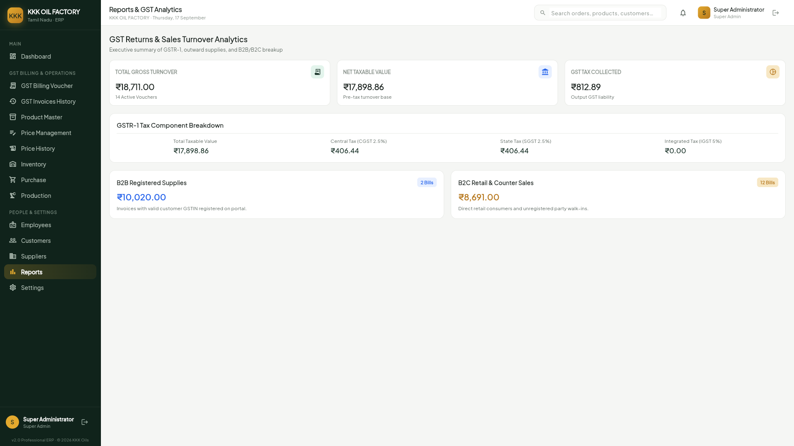
- **நோக்கம்**: அரசு ஜிஎஸ்டி தாக்கல் செய்வதற்கும் (GSTR-1), மாதாந்திர நிதி அறிக்கைகளை தணிக்கையாளருக்கு அனுப்புவதற்கும் பயன்படும் திரை.
- **முக்கிய பொத்தான்கள்**:
  - `Generate GSTR-1 JSON` : அரசு ஜிஎஸ்டி போர்ட்டலில் நேரடியாக பதிவேற்ற கோப்பு உருவாக்க.
  - `Download Excel Summary` : அனைத்து விற்பனை கணக்குகளையும் எக்செல் கோப்பாக எடுக்க.
  - `Print Monthly Tax Statement` : மாதாந்திர வரி அறிக்கையை ஆடிட்டர் பார்வைக்கு அச்சிட.

---

## 14 · Staff Directory & Access (`/employees`)
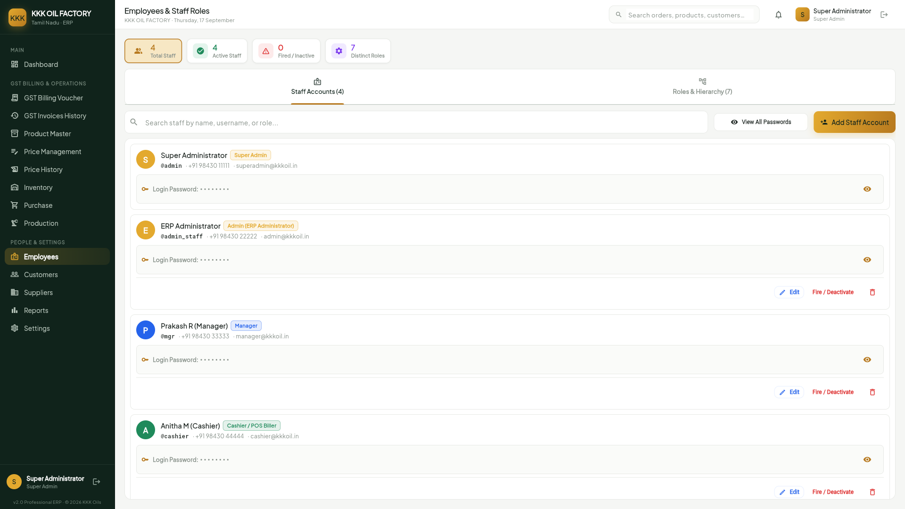
- **நோக்கம்**: ஆலை ஊழியர்களின் விபரங்கள் மற்றும் அவர்களுக்கான மென்பொருள் அனுமதி அதிகாரங்களை நிர்வகிக்கும் திரை.
- **முக்கிய பொத்தான்கள்**:
  - `+ Add Employee` : புதிய பணியாளருக்கு கணினி பயனர் கணக்கு உருவாக்க.
  - `Edit Permissions` : ஊழியரின் மென்பொருள் அனுமதிகளை மாற்றியமைக்க.
  - `Reset Password` : மறந்துபோன கடவுச்சொல்லை மாற்றி புதிய கடவுச்சொல் வழங்க.

---

## 15 · Hardware & System Setup (`/settings`)
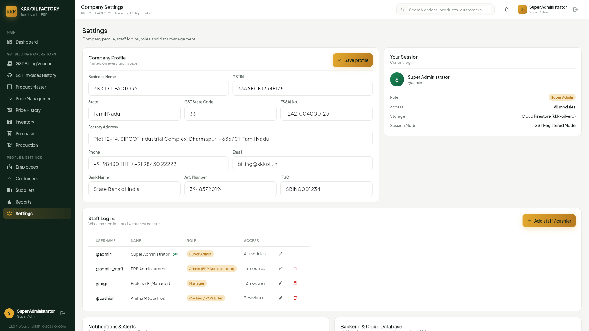
- **நோக்கம்**: ஆலை பெயர், முகவரி, FSSAI உரிம எண், வங்கி விவரங்கள் மற்றும் பில் பிரிண்டர் இணைப்புகளை அமைக்கும் திரை.
- **முக்கிய பொத்தான்கள்**:
  - `Save All Settings` : மாற்றிய அனைத்து ஆலை அமைப்புகளையும் உறுதி செய்து சேமிக்க.
  - `Test Print (Thermal)` : சிறிய தெர்மல் பில் பிரிண்டர் சரியாக அச்சிடுகிறதா என பார்க்க.
  - `Test Print (A4)` : A4 லேசர் பிரிண்டர் இணைப்பு சோதிக்க.
  - `Backup Database Now` : கணினியில் உள்ள அனைத்து கணக்குகளையும் உடனே பேக்கப் எடுக்க.

---

## M-01 · Mobile Login Gateway

- **நோக்கம்**: ஸ்மார்ட்போன்களில் பணியாளர்கள் எளிதாக உள்நுழைய பயன்படும் முகப்பு திரை (அடர் பிரவுன் பின்னணி & தங்க கே.கே.கே லோகோ).
- **முக்கிய பொத்தான்கள்**: `Sign in`, `Show Password (Eye)`, `Supervisor Quick Fill`, `Cashier Quick Fill`.
- **வேலை செய்யும் முறை**: கைபேசியில் பயனர் பெயர் மற்றும் கடவுச்சொல்லை உள்ளிட்டு `Sign in` அழுத்தவும்.

---

## M-02 · Mobile Operations Dashboard
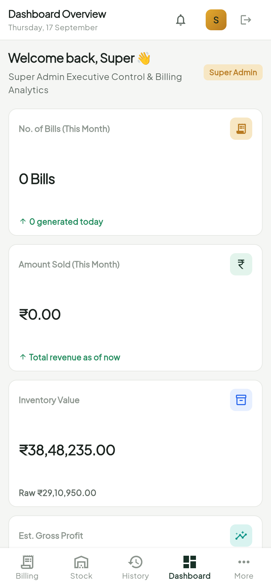
- **நோக்கம்**: உரிமையாளர் மற்றும் மேலாளர்கள் எங்கிருந்தாலும் அன்றாட விற்பனை மற்றும் தொட்டி இருப்பை மொபைலில் உடனுக்குடன் அறிய உதவும் திரை.
- **முக்கிய பொத்தான்கள்**: `Fast Billing POS`, `Check Silo Levels`, `Refresh View`.

---

## M-03 · Mobile Fast Billing POS
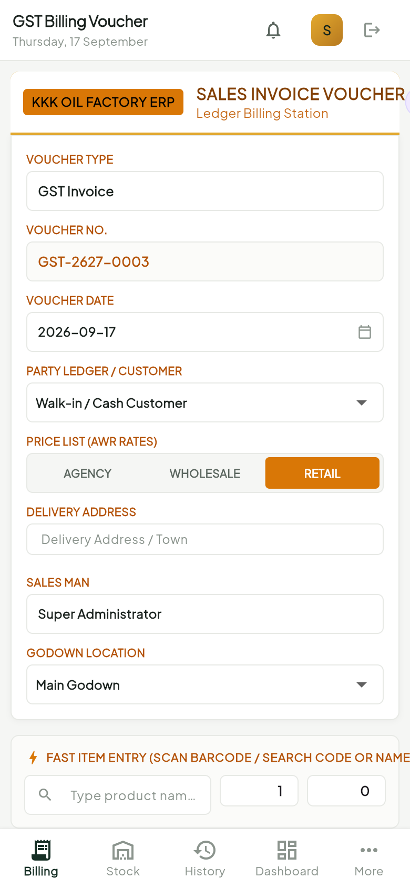
- **நோக்கம்**: ஆலை வாசலில் வாடிக்கையாளர்களுக்கு கைபேசி மூலமாகவே அதிவேகமாக பில் போட்டு புளூடூத் பிரிண்டரில் ரசீது தரும் திரை.
- **முக்கிய பொத்தான்கள்**: `Generate Bill`, `Print Bluetooth Receipt`, `Share WhatsApp Bill`, `Pay: CASH / UPI`.

---

## M-04 · Mobile Silo Tanks & Stock Gauges
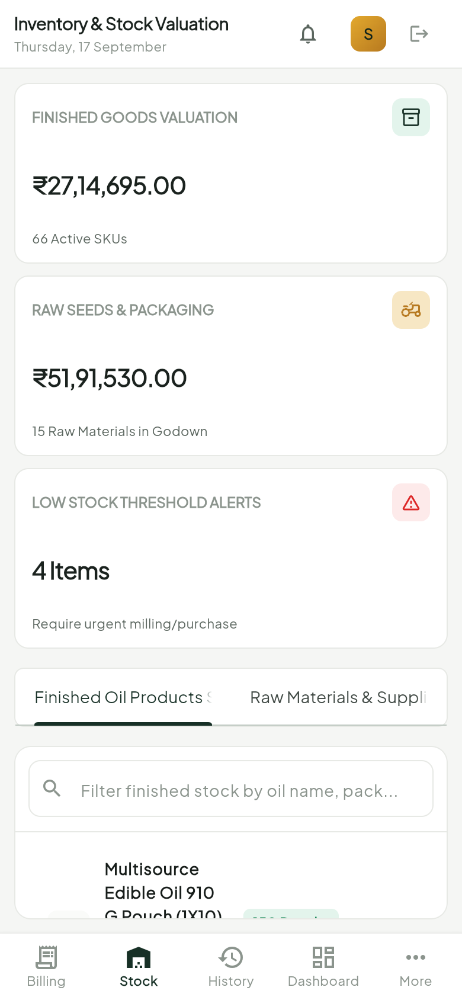
- **நோக்கம்**: ஆலைக்குள் உள்ள எண்ணெய் தொட்டிகள் மற்றும் குடோன் இருப்பை ஆலைக்குள்ளேயே நடந்து சென்று மொபைலில் சரிபார்க்க உதவும் திரை.
- **முக்கிய பொத்தான்கள்**: `Log Physical Dip`, `Alert Manager`, `Scan Barcode Stock`.

---

## M-05 · Mobile Voucher History & Reprints

- **நோக்கம்**: கைபேசி வழியாக போடப்பட்ட அனைத்து விற்பனை ரசீதுகளையும் பட்டியலாக பார்த்து, தேவைப்பட்டால் மீண்டும் அச்சிட உதவும் திரை.
- **முக்கிய பொத்தான்கள்**: `Reprint Receipt`, `Send SMS Receipt`, `WhatsApp Share`.

---

## M-06 · Mobile More Modules Navigation Hub
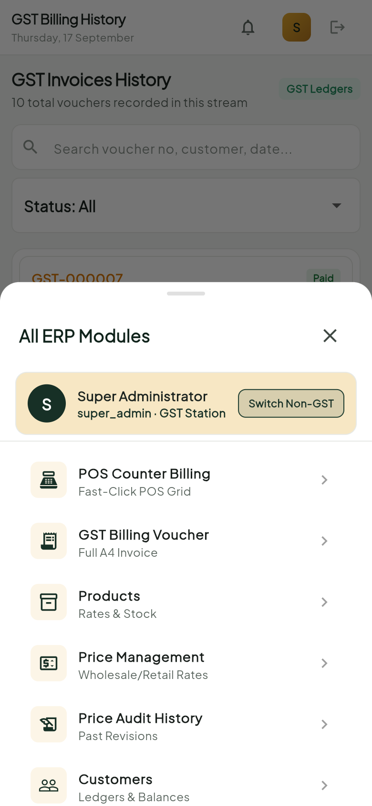
- **நோக்கம்**: கொள்முதல், உற்பத்தி, வாடிக்கையாளர்கள் மற்றும் புளூடூத் பிரிண்டர் அமைப்புகளுக்கான மொபைல் முதன்மை மெனு திரை.
- **முக்கிய பொத்தான்கள்**: `Connect Printer`, `Sync Offline Bills`, `Logout`.

---

## Master Button Reference Index (பொத்தான்கள் சுருக்க பட்டியல்)
| சுருக்குவழி | பொத்தான் பெயர் | பயன்படும் திரை | செயல்முறை விளக்கம் |
| :--- | :--- | :--- | :--- |
| **F2** | `Save Invoice` | `/billing` | பில்லை சேமித்து, சரக்கு இருப்பு கழித்து, பில் தயார் செய்யும். |
| **F4** | `Read Weighbridge` | `/purchase` | எடைமேடையில் உள்ள லாரியின் எடையை தானாக திரையில் கொண்டுவரும். |
| **Ctrl + P** | `Print Invoice` | `/billing` & `/history` | A4 அல்லது தெர்மல் பில்லை உடனடியாக அச்சிடும். |
| **Esc** | `Clear Form` | அனைத்து திரைகள் | தவறாக தட்டச்சு செய்த விவரங்களை உடனே அழித்து புதிய படிவமாக்கும். |

---

## Daily SOP: ஆலை தினசரி செயல்முறை வழிகாட்டி (Morning to Night)
1. **காலை 08:00 AM**: கணினி & பிரிண்டரை ஆன் செய்து, `/inventory` சென்று எண்ணெய் தொட்டி இருப்பை சரிபார்க்கவும்.
2. **காலை 09:00 AM**: `/price-management` சென்று இன்றைய மண்டி விலைக்கு ஏற்ப விலையை புதுப்பித்து `Update All Prices` அழுத்தவும்.
3. **பகல் 10:00 AM - 05:00 PM**: வாடிக்கையாளர்களுக்கு `F2` மூலம் விற்பனை பில் போடுதல்; லாரிகளுக்கு `F4` மூலம் விதை வரவு பதிவு செய்தல்.
4. **மாலை 06:00 PM**: `/production` சென்று அரவை செய்யப்பட்ட எண்ணெய் மற்றும் புண்ணாக்கு அளவை பதிவு செய்து `Complete Milling Batch` கொடுக்கவும்.
5. **இரவு 08:00 PM**: கல்லா ரொக்கத்தை சரிபார்த்து, `/reports` மூலம் விற்பனை சுருக்கம் எடுத்து, `/settings` சென்று `Backup Database Now` கொடுத்து பேக்கப் எடுக்கவும்.
